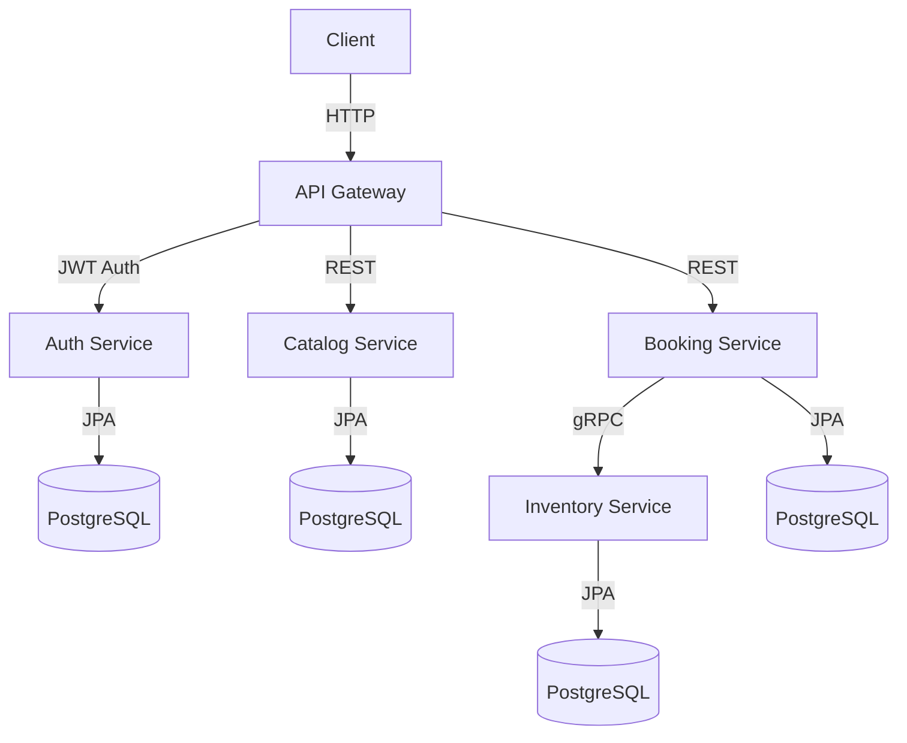

# Microservices-based Ticketing Platform

A sample ticketing system demonstrating microservice architecture with Spring Boot and gRPC.

## Architecture



Each service runs independently on its own port and persists data in its own database:

| Service | Port | Description |
|---------|------|-------------|
| Gateway | 8080 | Routes external requests and performs coarse-grained auth |
| Catalog | 8081 | Events, venues and price tiers |
| Inventory | 8082 (gRPC 9090) | Seat availability and locking |
| Booking | 8083 | Orchestrates booking workflow |
| Auth | 8084 | User registration and token issuance |

Each service's data is isolated in its own PostgreSQL database (`auth`, `catalog`, `inventory`, `booking`).

The `ticketing-shared-lib` module holds protobuf definitions used by inventory and booking.

## Request workflow

1. **Authenticate**  
   Users register and log in via the Auth Service to obtain a JWT.
2. **Browse catalog**  
   Clients call the Gateway which forwards requests to the Catalog Service for events and seating info.
3. **Start a booking**  
   The Booking Service initiates a booking through the Gateway and asks the Inventory Service (via gRPC) to lock seats.
4. **Confirm or cancel**  
   After payment confirmation the Booking Service finalizes the order and tells Inventory to sell seats. Cancellation releases the locks.

## Repository structure

```
├─ ticketing-auth-service       # JWT issuance and user management
├─ ticketing-catalog-service    # Event and venue data
├─ ticketing-inventory-service  # Seat management exposed over gRPC
├─ ticketing-booking-service    # Booking orchestration
├─ ticketing-gateway-service    # API gateway / edge service
├─ ticketing-shared-lib         # Protobuf definitions shared across services
└─ ticketing-platform.postman_collection.json  # Example API requests
```

## Run locally

### Prerequisites

- JDK 21
- Maven
- Docker (for PostgreSQL)
- `JWT_SECRET` environment variable (same for all services)

### Steps

1. **Clone the repository**

   ```bash
   git clone <repo-url>
   cd microservices-based-ticketing-platform
   ```

2. **Build shared protobuf library**

   ```bash
   cd ticketing-shared-lib
   ./mvnw install
   cd ..
   ```

3. **Start PostgreSQL instances**

   Each service connects to its own database:

   ```bash
   docker run --name auth-postgres -e POSTGRES_DB=auth -e POSTGRES_PASSWORD=postgres -p 5433:5432 -d postgres
   docker run --name catalog-postgres -e POSTGRES_DB=catalog -e POSTGRES_PASSWORD=postgres -p 5434:5432 -d postgres
   docker run --name inventory-postgres -e POSTGRES_DB=inventory -e POSTGRES_PASSWORD=postgres -p 5435:5432 -d postgres
   docker run --name booking-postgres -e POSTGRES_DB=booking -e POSTGRES_PASSWORD=postgres -p 5436:5432 -d postgres
   ```

   Adjust the JDBC URLs in each service if you change ports or container names.

4. **Run each service** (in separate terminals)

   ```bash
   export JWT_SECRET=supersecret
   cd ticketing-catalog-service && ./mvnw spring-boot:run
   cd ticketing-inventory-service && ./mvnw spring-boot:run
   cd ticketing-booking-service && ./mvnw spring-boot:run
   cd ticketing-auth-service && ./mvnw spring-boot:run
   cd ticketing-gateway-service && ./mvnw spring-boot:run
   ```

5. **Use the platform**

   Access APIs through the gateway at `http://localhost:8080/api/...`  
   A Postman collection `ticketing-platform.postman_collection.json` is provided for example requests.

## JWT Secret Configuration

All services use a shared HMAC secret to sign and validate JWT tokens. The auth service signs tokens while the gateway and downstream services re-validate them using the same secret.

Configure the secret via the `JWT_SECRET` environment variable or the `jwt.secret` property in each service's `application.properties`. **The value must be identical across all services** to ensure validation succeeds.

### Rotating the secret

1. Provide a new value for `JWT_SECRET` and redeploy all services so they can validate tokens signed with the new secret.
2. Restart the auth service last to begin issuing tokens with the new secret.
3. After previously issued tokens expire, remove the old secret value from your configuration.
